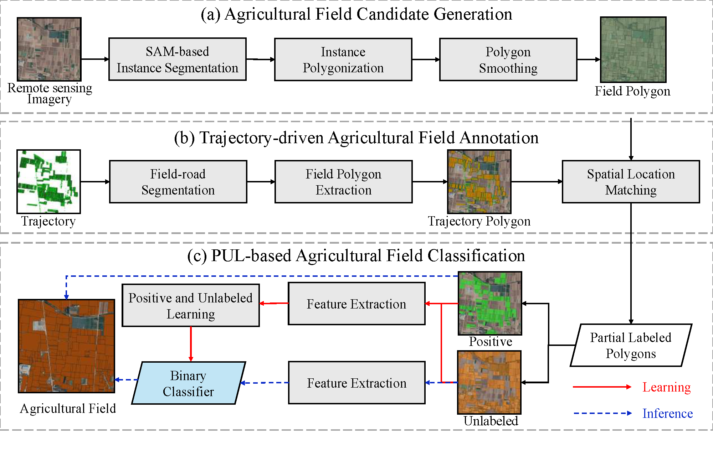

# FieldMapper

This is the implementation of FieldMapper.

## Dataset

The study area is a rural region of the city of Tai'an, Shandong Province, China, which is geographically situated between 35.97°N–35.99°N latitude and 117.02°E–117.04°E longitude, representing a typical landscape of the North China Plain.

### Remote sensing imagery

The remote sensing imagery can be get at [Google Map](https://www.google.com/maps). We use Google Earth Pro 7.3 to download high resolution images of this area. 
The exact longitute and latitute of box is: 
```shell
35.978874117
35.992210060
117.023308128
117.041077763
```

### Agricultural machinery trajectory

The agricultural machinery trajectory dataset with similar structure is released by Key Laboratory of Agricultural Machinery Monitoring and Big Data Application, Ministry of Agriculture and Rural Affairs, China at [Agribigdata](https://github.com/Agribigdata/public_trajectory_dataset). 

The trajectories supporting the findings of this study are available upon reasonable request. 

## Architechture


Three step delineation. a) Agricultural Field Candidate Generation, which generates all agricultural field candidate polygons based on remote sensing imagery via a vision foundation model; b) Trajectory-driven Agricultural Field Annotation, which leverages agricultural machinery trajectories to label agricultural fields from extracted candidate polygons; and c) PUL-based Agricultural Field Classification, which trains an agricultural field classification model to identify agricultural fields from remaining polygons via positive and unlabeled learning.

## Todo List

Coming soon...

- Baselines
    - ~~Deep learning method~~
    - Foundation model
- Method

## Acknowledgement

- [pytorch-segmentation](https://github.com/yassouali/pytorch-segmentation)
- [SAM](https://github.com/facebookresearch/segment-anything)
